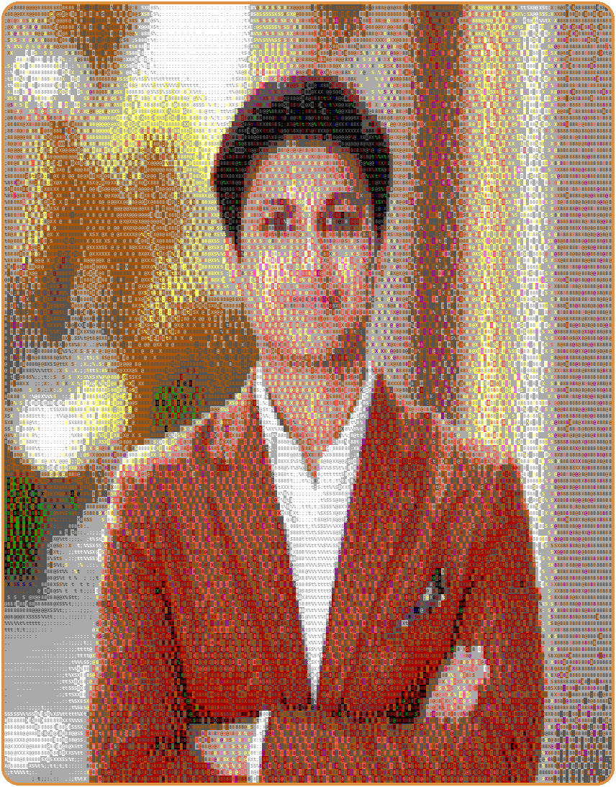
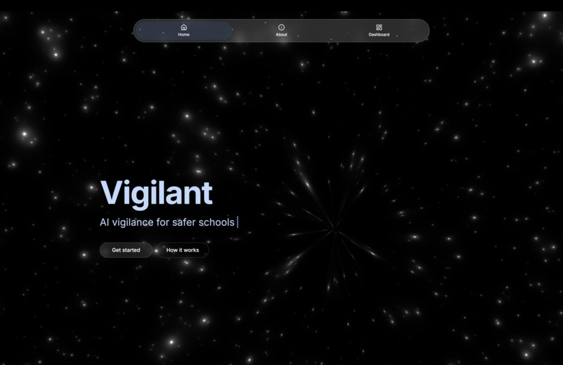
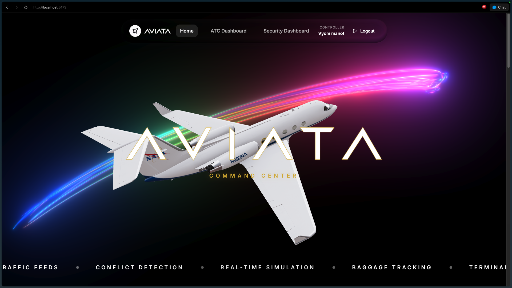
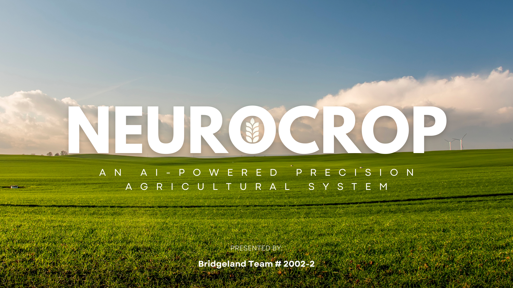
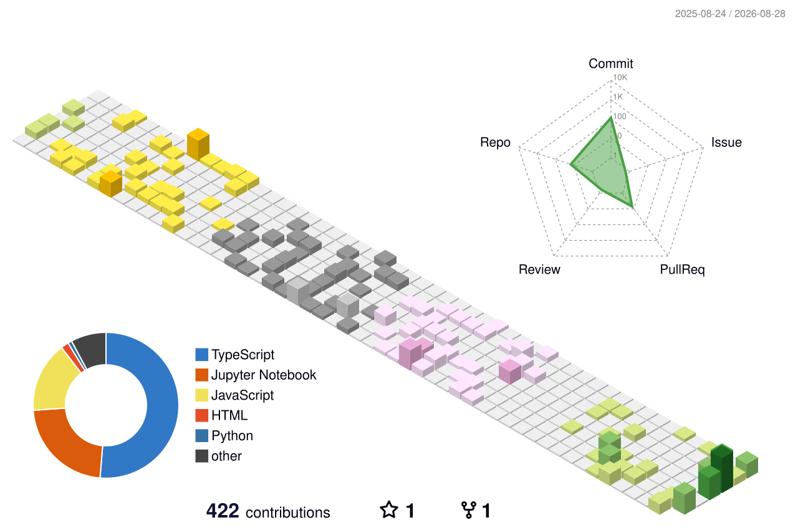

  

    

  
  
  

 

<table>
  <tr>
    <td width="46%" valign="top" align="center">
      
    </td>
    <td width="54%" valign="top">

### 👋 About Me

Hey! I'm a Computer Science student deeply interested in SWE, AI, cybersecurity, and other emerging technologies.

I am a passionate builder; whether for something I greatly care about or a tool that I need, I am always actively thinking outside the box to solve problems I see in my everyday life.

I'm also a driven leader in several major student-led organizations where I enjoy directing teams and creating meaningful impact.

If you are working on something exciting or looking to collaborate, feel free to reach out at **arnavjain.cs@gmail.com**!

 

🎓 Computer Science Student &nbsp;|&nbsp; 🛠️ Builder at Heart &nbsp;|&nbsp; 🧭 Team & Org Leader &nbsp;|&nbsp; 📬 Always Open to Collaborate

  </td>
  </tr>
</table>

 

## 🧰 Tech Stack & Skills

**Languages**

**AI, Machine Learning & Computer Vision**

**Web & App Development**

**Cybersecurity & Emerging Tech**

**Cloud, DevOps & Tools**

 

## 🚀 Featured Projects

<table>
  <tr>
    <td width="33.33%" align="center" valign="top">
      
       
      <a href="https://github.com/arnavjain-cs/Vigilant"><strong>Vigilant</strong></a>
       
      AI vigilance for safer schools
    </td>
    <td width="33.33%" align="center" valign="top">
      
       
      <a href="https://github.com/arnavjain-cs/Aviata"><strong>Aviata</strong></a>
       
      Real-time aviation command center
    </td>
    <td width="33.33%" align="center" valign="top">
      
       
      <a href="https://github.com/arnavjain-cs/2025-TSA-Nationals-Software-Development-Team-1602-1"><strong>Neurocrop</strong></a>
       
      AI-powered precision agriculture
    </td>
  </tr>
</table>

 

## 📊 GitHub Stats

  
  
   
  

 

## 🌐 3D Contribution Activity

  

 

## 📬 Let's Connect

If you are working on something exciting or looking to collaborate, feel free to reach out!

  

