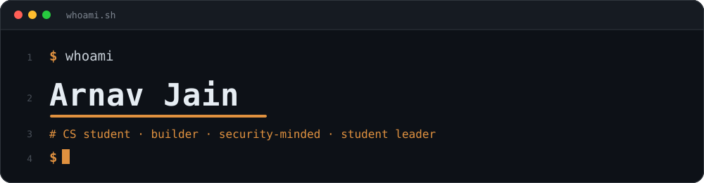
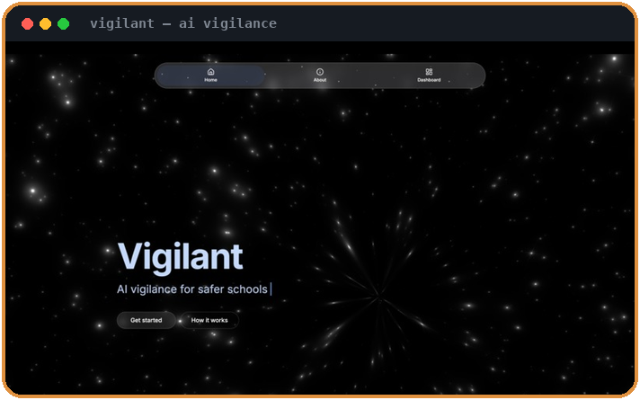
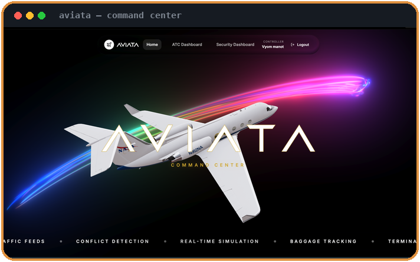
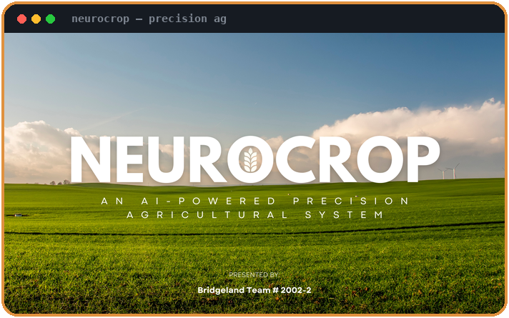
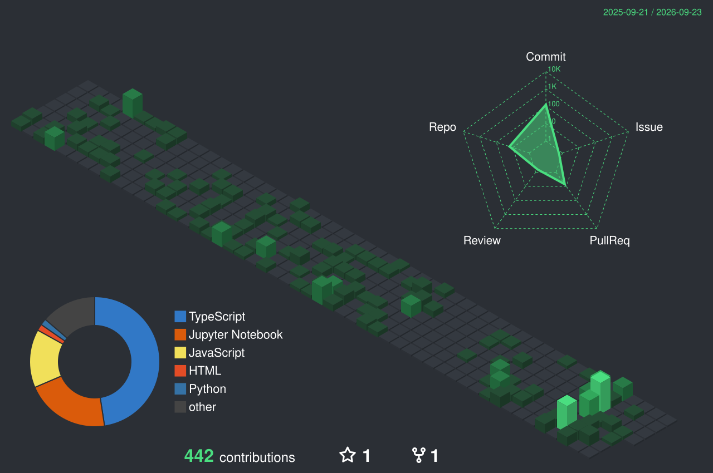
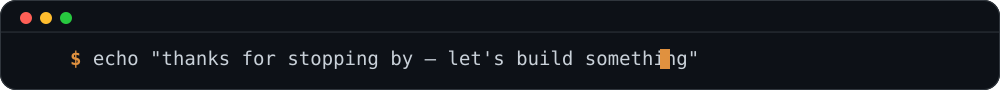

  

  

 

### 👋 About Me

Hey! I'm a Computer Science student deeply interested in SWE, AI, cybersecurity, and other emerging technologies.

I am a passionate builder; whether for something I greatly care about or a tool that I need, I am always actively thinking outside the box to solve problems I see in my everyday life.

I'm also a driven leader in several major student led organizations where I enjoy directing teams and creating meaningful impact.

If you are working on something exciting or looking to collaborate, feel free to reach out at **arnavjain.cs@gmail.com**!

<!--
  Real colored ASCII art (not a photo) — each cell below is an actual monospace
  character, rendered as vector SVG text and staggered in with a one-time
  reveal animation (top-to-bottom, left-to-right, ~3s) via SMIL <animate>.
  Same technique readme-typing-svg uses, so it plays fine embedded as an .
-->

&nbsp;Computer Science Student &nbsp;|&nbsp; &nbsp;Builder at Heart &nbsp;|&nbsp; &nbsp;Team &amp; Org Leader &nbsp;

 

## Tech Stack & Skills

**Languages**

**AI, Machine Learning & Computer Vision**

**Web & App Development**

**Cybersecurity & Emerging Tech**

**Cloud, DevOps & Tools**

 

## Featured Projects

### [Vigilant](https://github.com/arnavjain-cs/Vigilant)

AI-powered vigilance system built for safer schools — real-time detection and alerting.

### [Aviata](https://github.com/arnavjain-cs/Aviata)

An aviation command center unifying ATC, security, and baggage-tracking dashboards with real-time conflict detection and simulation.

### [NeuroCrop](https://github.com/arnavjain-cs/2025-TSA-Nationals-Software-Development-Team-1602-1)

An AI-powered precision agriculture system — TSA Nationals Software Development Conference

 

## GitHub Stats

 

 

 

## Let's Connect

If you are working on something exciting or looking to collaborate, feel free to reach out!

  

